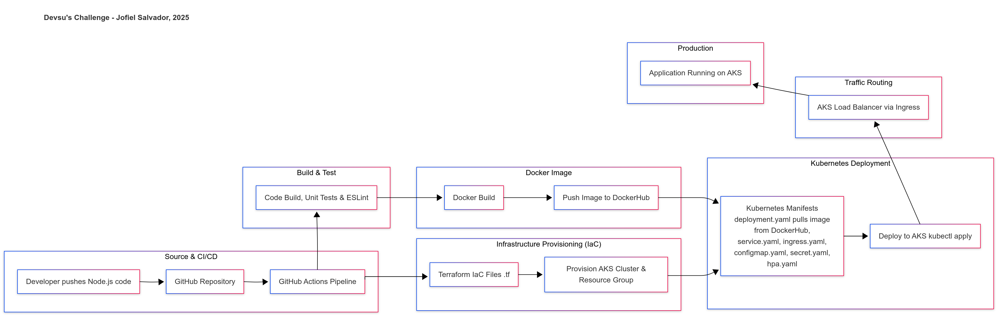

# Demo DevOps Node.js Application

Welcome! This repository showcases a full DevOps workflow leveraging **containerization**, **CI/CD automation**, **security scanning**, and **Kubernetes deployment on Azure**.

---
## Architecture Diagram

This project follows a **cloud-native architecture**, integrating CI/CD pipelines, security scanning, Kubernetes deployments, and infrastructure as code. Below is an overview of the system’s workflow:

---
## Table of Contents

- [Introduction](#introduction)
- [Demo Overview](#demo-overview)
- [Tech Stack](#tech-stack)
- [Prerequisites](#prerequisites)
- [CI/CD Pipeline Workflow](#ci-cd-pipeline-workflow)
- [Kubernetes Deployment](#kubernetes-deployment)
- [Cleanup on Failure](#cleanup-on-failure)
- [Attachments](#attachments)
- [Contact](#contact)

---

## Introduction

This project implements **modern cloud-native DevOps practices**, integrating:

- **Containerization:** Docker ensures seamless environment replication.
- **CI/CD Pipelines:** Automated workflows via GitHub Actions streamline testing, security, and deployment.
- **Kubernetes Deployment:** Hosted on Azure Kubernetes Service (AKS) with autoscaling and high availability.
- **Infrastructure as Code:** Terraform provisions and manages cloud resources efficiently.

---

## Demo Overview

The project consists of:

- **Node.js Application:** A scalable API with containerized deployment.
- **Optimized Dockerization:** Includes environment variables, health checks, and non-root execution.
- **CI/CD Pipeline:** Automated through GitHub Actions covering:
  - Code Build & Packaging
  - Unit Tests & Static Code Analysis (ESLint, Jest, NPM Audit)
  - Docker Image Build & Push to Docker Hub
  - Vulnerability Scanning (Trivy)
  - Kubernetes Deployment to AKS
  - Terraform Infrastructure Provisioning
  - Cleanup on Failure (Terraform destroy)

**Key Project Links:**

- **GitHub Repository:** [jofi-art/devsu-demo-devops-nodejs](https://github.com/jofi-art/devsu-demo-devops-nodejs)
- **Docker Image:** [jofiart/demo-devops-nodejs](https://hub.docker.com/r/jofiart/demo-devops-nodejs)
- **Application Endpoint:** [http://app.demo-devopsdevsujofiart.online/api/users](http://app.demo-devopsdevsujofiart.online/api/users)
- **CI/CD Pipeline Execution:** [Workflow latest run](https://github.com/jofi-art/devsu-demo-devops-nodejs/actions/runs/15650672787)

---

## Tech Stack

- **Node.js:** Asynchronous, scalable application framework.
- **Docker:** Ensures environment consistency and portability.
- **Kubernetes (AKS):** Manages containerized applications at scale.
- **GitHub & GitHub Actions:** Automates version control and CI/CD workflows.
- **Terraform:** Simplifies cloud infrastructure provisioning.
- **Security Tools:** ESLint, Jest, NPM Audit, Trivy for code quality and vulnerability scanning.

---

## Prerequisites

To deploy and work with this project, ensure:

- **Azure Subscription** is configured, and the Subscription ID is validated.
- **Service Principal** is created in Microsoft Entra ID for authentication and access control.
- **GitHub Secrets** are set up for Azure and Docker authentication.
- **Docker & Kubernetes** are installed, with a local cluster like Minikube or Docker Desktop.

---

## CI/CD Pipeline Workflow

The **GitHub Actions pipeline** automates critical DevOps processes, divided into five primary jobs:

### 1️⃣ Tests (Unit Testing & Code Analysis)
- Runs unit tests using Jest.
- Generates code coverage report.
- Performs static code analysis using ESLint.
- Runs additional vulnerability scans via `npm audit`.

### 2️⃣ Build & Push Docker Image
- Builds a secure Docker image for deployment.
- Executes a Trivy vulnerability scan (CRITICAL/HIGH severity).
- Pushes the finalized image to Docker Hub.

### 3️⃣ Infrastructure Deployment (Terraform)
- Authenticates to Azure using GitHub Secrets.
- Initializes Terraform, plans, and applies infrastructure provisioning.
- Stores the Terraform state for rollback purposes.

### 4️⃣ Application Deployment to AKS
- Retrieves AKS credentials.
- Applies Kubernetes manifests (ConfigMaps, Secrets, Services, Deployment, HPA, Ingress).
- Waits for successful rollout and verifies the deployment.

### 5️⃣ Cleanup on Failure (Rollback)
- If the application deployment fails, Terraform automatically destroys provisioned resources.

---
## Cleanup on Failure

To ensure resource efficiency and prevent unnecessary costs, the pipeline includes **automatic cleanup** in the event of a failed deployment. If the **application deployment** does not succeed, the **cleanup job is triggered**, removing all provisioned resources from Azure.

### **Rollback Steps**
1️⃣ **Download Terraform state file**  
   - Retrieves stored Terraform state from previous infrastructure provisioning to maintain tracking.

2️⃣ **Extract and restore Terraform state**  
   - Ensures Terraform is aware of already-provisioned resources for accurate rollback.

3️⃣ **Reinitialize Terraform**  
   - Runs `terraform init` to set up backend configurations before deletion.

4️⃣ **Destroy Azure resources**  
   - Executes `terraform destroy -auto-approve`, cleaning up all allocated cloud infrastructure.

This cleanup mechanism maintains **cloud hygiene, cost efficiency, and prevents stale deployments from lingering**, ensuring that failed workflows do not impact future deployments.

---
## Kubernetes Deployment

### 1️⃣ `configmap.yaml`
- **Stores non-sensitive configuration values** required by the application.
- Used to pass **environment variables** dynamically without modifying the container.

### 2️⃣ `secret.yaml`
- **Securely manages sensitive credentials** like API keys or database passwords.
- Prevents hardcoding sensitive data in deployments.

### 3️⃣ `service.yaml`
- **Exposes the application within the cluster**, allowing pods to communicate internally.
- Configured as a **LoadBalancer or ClusterIP** for routing incoming traffic.

### 4️⃣ `deployment.yaml`
- **Manages the application's workload**, ensuring pod replication and rolling updates.
- Defines **resource requests and limits** for CPU and memory allocation.
- Includes a **liveness probe** to monitor container health and restart it if necessary.

### 5️⃣ `hpa.yaml`
- Implements **Horizontal Pod Autoscaling (HPA)**.
- Automatically **scales pods** based on CPU utilization thresholds.

### 6️⃣ `ingress.yaml`
- **Handles external traffic routing** for the application.
- Defines **TLS termination** for secure HTTPS access.
- Supports **domain-based routing** for structured ingress rules.

---

## Attachments

A document with the project's comments, architecture diagrams, and execution screenshots can be found in the `/docs` directory.

---

## Contact

**Jofiel Salvador**
- GitHub: [jofi-art](https://github.com/jofi-art)
- Email: [jofiel21-02@outlook.es](jofiel21-02@outlook.es)
- LinkedIn: [Profile Link](https://www.linkedin.com/in/jofiel-arturo-salvador-contreras-813399148/?locale=en_US)
